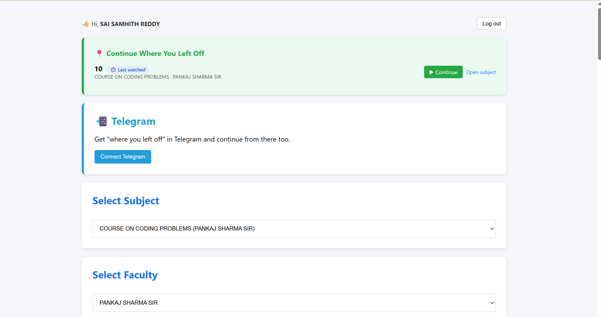
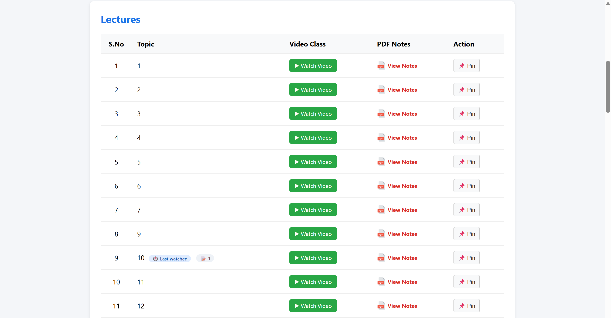
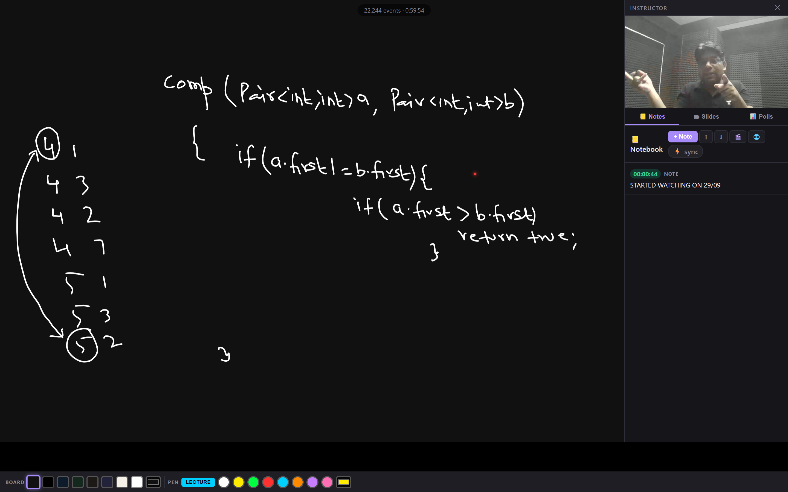
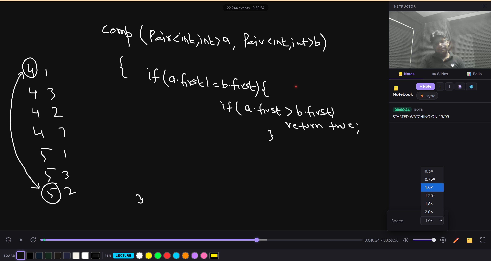
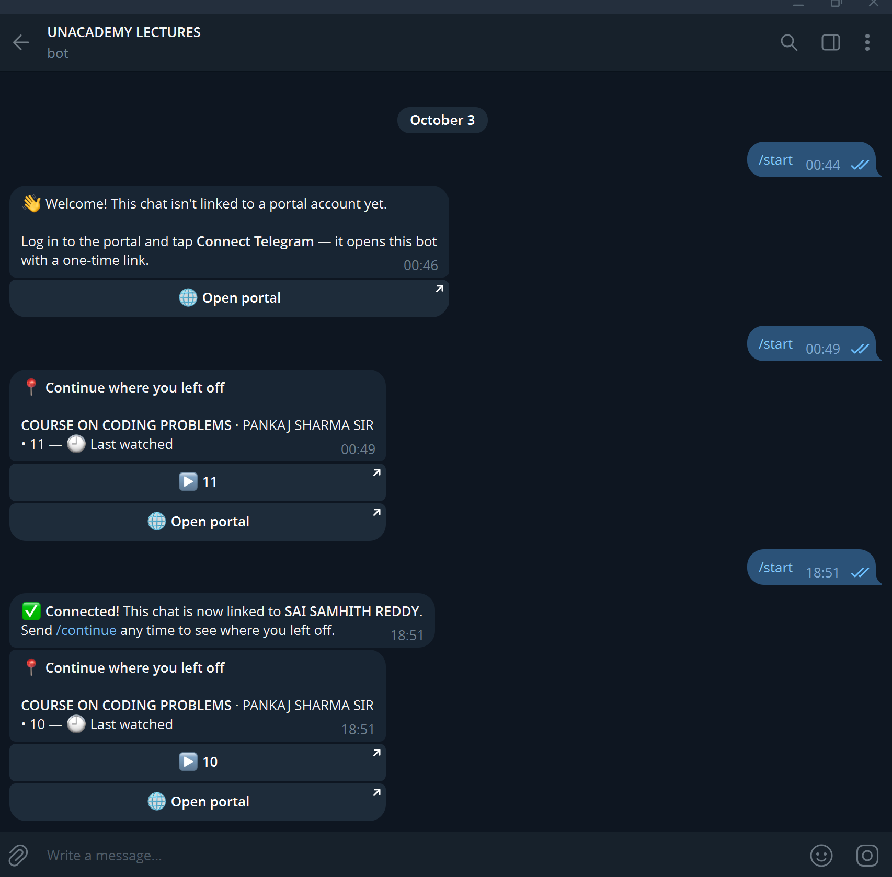

# 🎓 Lecture Portal & Player

A self-hosted portal for replaying recorded lectures. The custom player shows the lecture video, the instructor's whiteboard writing and the slides together, all in sync. Students log in, pick a subject and faculty, watch lectures, take timestamped notes and continue from where they left off. They can do that on the web or through a Telegram bot.

Built with **PHP + MySQL** on the backend and plain **HTML / CSS / JavaScript** on the frontend.

---

## ✨ Features

- 🔐 **Student login / signup.** Progress, pins and notes are saved per account.
- 📍 **Continue where you left off.** The dashboard shows the last lecture you watched, with a one-click resume.
- 📚 **Subject & faculty selection.** Lectures are listed with **Watch Video**, **View Notes (PDF)** and **Pin**.
- 🎬 **Custom lecture player**
  - Replays the instructor's whiteboard writing in sync with the video, from a recorded event log
  - Shows the instructor's camera in a side panel
  - Has **Notes**, **Slides** and **Polls** tabs
  - Lets you add timestamped notes while watching (the 📒 Notebook)
  - Offers playback speeds from 0.5× to 2×, seeking, ±10s skip, volume and fullscreen
  - Lets you change the board background and pen colours
- 🤖 **Telegram bot**
  - Links your Telegram chat to your portal account with a one-time link
  - `/continue` shows your last watched lecture with a direct play button

---

## 📸 Screenshots

### Dashboard: Continue Where You Left Off

### Lecture List

### Lecture Player: Synced Whiteboard + Instructor Cam + Notes

### Player Controls: Speed, Seek, Volume, Fullscreen

### Telegram Bot: Resume from Telegram

---

## 🛠️ Tech Stack

| Layer    | Tech                                          |
|----------|-----------------------------------------------|
| Backend  | PHP, MySQL                                    |
| Frontend | HTML, CSS, JavaScript (single-file player)    |
| Bot      | Telegram Bot API (PHP webhook)                |
| Hosting  | cPanel shared hosting                         |

---

